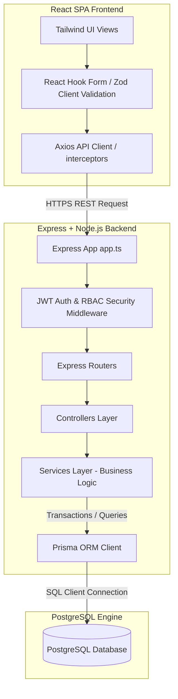
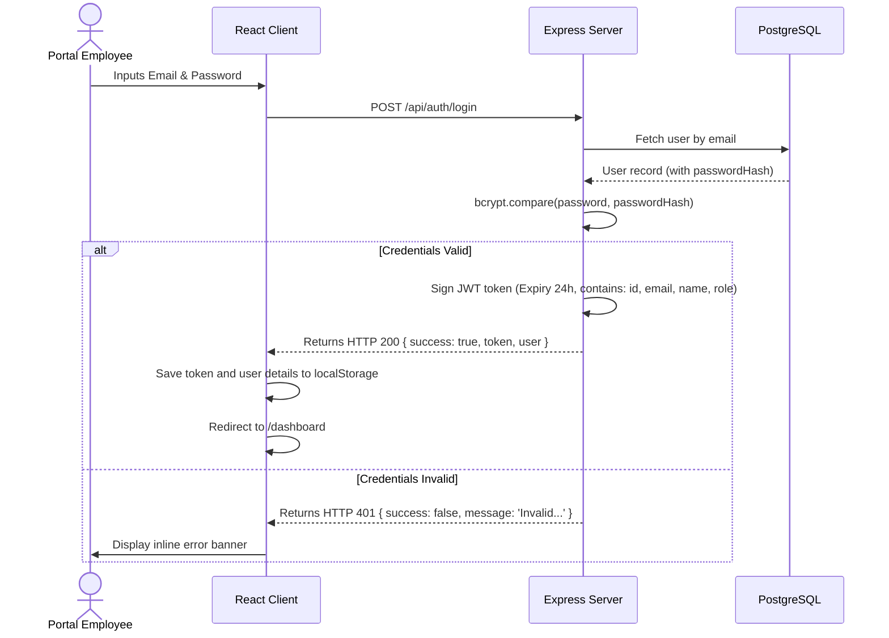
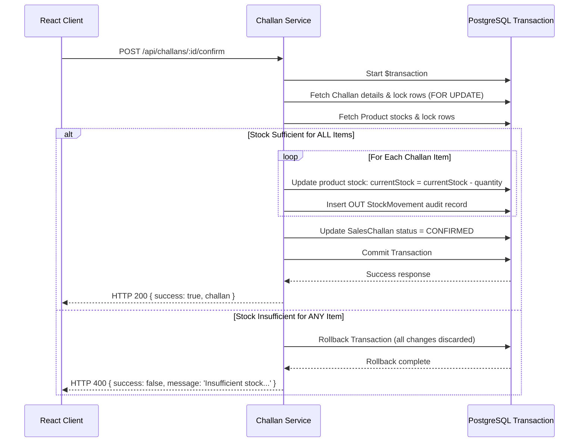

# System Architecture Documentation

This document explains the software architecture, database transaction design, and role privileges structure implemented in the Mini ERP + CRM Portal.

## Data Flow Diagram

The application is structured as a monolithic monorepo with clear separation between the presentation tier (client) and the database access/business rules tier (server).

---

## 1. Authentication & Security Flow

Platform security relies on JSON Web Token (JWT) stateless tokens passed via request HTTP headers.

1. **Persistent Session**: When the browser loads, a `useEffect` hook in `AuthContext` checks if a token exists in `localStorage`. If yes, it calls `GET /api/auth/me`. The server decodes the token, checks if the user is still active in the database, and returns updated user details.
2. **Access Security**: Secure endpoints are guarded by two Express middlewares:
   - `authenticate`: Extracts token from `Authorization: Bearer <token>` header, decodes via `jwt.verify`, and attaches `req.user` context.
   - `authorize(...roles)`: Verifies if `req.user.role` matches one of the roles allowed for that endpoint. Otherwise, it immediately returns `HTTP 403 Forbidden` without hitting database layers.

---

## 2. Challan Confirmation: Atomic Inventory Transactions

Confirming a challan is the most critical operation in the platform. Stock deduction is designed to be **atomic** (all-or-nothing) and resistant to race conditions.

### Key Safety Implementations
* **Atomicity (`$transaction`)**: Implemented using Prisma's transactional engine. If updating product A succeeds but product B has insufficient stock, the transaction is rejected, and product A's stock is rolled back to its original state.
* **Race-Condition Prevention (`FOR UPDATE`)**: The transaction uses raw locks (`SELECT ... FOR UPDATE`) during product fetching. This locks the database row for the product being modified, preventing other concurrent orders from reading stale stock values before the current transaction writes updates.
* **Snapshot Preservation**: Products prices, names, and SKUs are captured as snapshots inside `SalesChallanItem` when the draft is built. If a product's price or description is changed in the catalogue later, the historical challan item snapshot details remain unaltered.
